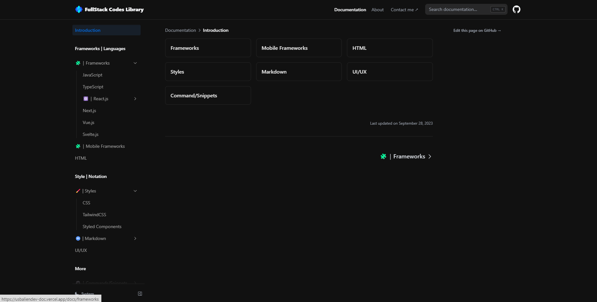

# Nextra Docs Template

This is my personal library of codes, knowlegde and tools, this project will constanlty be updated. This lib site was made using [Nextra](https://nextra.site).

[**Live Site→**](https://usbaliendev-doc.vercel.app/docs)

## Quick Start

Click the button to clone this repository and deploy it on Vercel:

## Local Development

First, run `pnpm i` to install the dependencies.

Then, run `pnpm dev` to start the development server and visit localhost:3000.

## License

This project is licensed under the MIT License.
